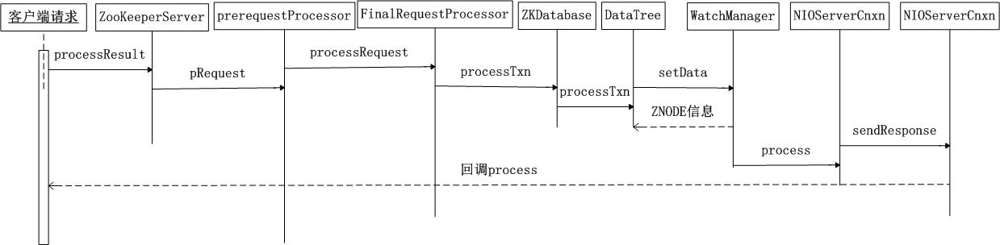

## 1、watcher为什么只实现一次监听，如何实现持久监听
答：

- 如果Watcher的注册是持久的，那么必然导致服务端的每次数据更新都会通知到客户端——这在数据变更非常频繁且监听客户端特别多的场景下，ZooKeeper无法保证性能。
- 实现持久监听：方法一：以递归方式实现节点状态的持续监控，方法二：实现Watcher接口，然后再实现process方法。总之就是先注册了watch然后返回了path的最新数据，这样就保证了如果在没有注册watch的这段时间内如果没有件听到数据的变化那么将通过n.data返回给client客户端。下面是方法1的写法：

		public class Server {

		    private static ZooKeeper zk;
		    private static final String CONNECT_STRING = "127.0.0.1:2181;
		    private static final int SESSION_TIMEOUT = 5000;
		    private static final String PARENT = "/watcher";
		    
		    public static void main(String[] args) throws Exception {
		        zk = new ZooKeeper(CONNECT_STRING, SESSION_TIMEOUT, new Watcher() {
		            
		            @Override
		            public void process(WatchedEvent event) {
		                String path = event.getPath();
		                EventType type = event.getType();
		                KeeperState state = event.getState();
		                System.out.println(path + "\t" + type + "\t" + state);
		                
		                // 循环监听
		                try {
		                    zk.getChildren(PARENT, true);
		                } catch (Exception e) {
		                    e.printStackTrace();
		                }
		            }
		        });
		        
		        // 添加监听
		        zk.getChildren(PARENT, true);
		        
		        // 模拟服务器一直运行
		        Thread.sleep(Long.MAX_VALUE);
		    }
		}

## 2、分析watcher的实现原理

Watcher 是启动一个客户端去接收从 ZooKeeper 服务端发过来的消息并且同步地处理这些信息。Watch是轻量级的，其实就是本地JVM的Callback，服务器端只是存了是否有设置了Watcher的布尔类型。客户端注册 watcher 有 3 种方式，getData、exists、getChildren。

1. 客户端的请求基本都是在 ClientCnxn 里面进行操作，当收到请求后，客户端会对当前客户端请求进行标记，将其设置为使用 Watcher 监听，通过 new Watcher()向构造方法中传入一个默认的 Watcher,将事件类型（EventType）、通知状态（WatchedEvent）、节点路径封装成一个 WatchedEvent 对象。 这个Watcher 将作为整个ZooKeeper 会话期间的默认 Watcher，会一直被保存在客户端 ZKWatchManager 的 defaultWatcher 中;

2. 根据数据节点的节点路径从 watchTable 里面取出对应的 Watcher。如果没有找到 Watcher 对象，说明没有任何客户端在该数据节点上注册过 Watcher，直接退出。如果找到了 Watcher 就将其提取出来，同时会直接从 watchTable 和 watch2Paths 里删除 Watcher，即 Watcher 是一次性的，触发一次就失效了。

3. 对于需要注册 Watcher 的请求，ZooKeeper 会把请求对应的 ServerCnxn 作为一个 Watcher 存储，所以这里调用的 process 方法实质上是 ServerCnxn 的对应方法，在请求头标记“-1”表示当前是一个通知，将 WatchedEvent 包装成 WatcherEvent 用于网络传输序列化，向客户端发送通知，真正的回调方法在客户端，servercnxn 又是一个抽象方法，有两个实现类，分别是：NIOServerCnxn 和
NettyServerCnxn。那接下来我们扒开 NIOServerCnxn 这个类的 process 方法

		public void process(WatchedEvent event) {
        ReplyHeader h = new ReplyHeader(-1, -1L, 0);
        if (LOG.isTraceEnabled()) {
            ZooTrace.logTraceMessage(LOG, ZooTrace.EVENT_DELIVERY_TRACE_MASK,
                                     "Deliver event " + event + " to 0x"
                                     + Long.toHexString(this.sessionId)
                                     + " through " + this);
        }

        // Convert WatchedEvent to a type that can be sent over the wire
		//look， 这个地方发送了一个事件，事件对象为 WatcherEvent。
        WatcherEvent e = event.getWrapper(); 

        sendResponse(h, e, "notification");
    }

4. 客户端收到消息后，会调用 ClientCnxn 的 SendThread.readResponse 方法来进行统一处理，如清单所示。如果响应头 replyHdr 中标识的 Xid 为 02，表示是 ping，如果为-4，表示是验证包，如果是-1，表示这是一个通知类型的响应，然后进行反序列化、处理 chrootPath、还原 WatchedEvent、回调 Watcher 等步骤，其中回调 Watcher 步骤将 WacthedEvent 对象交给 EventThread 线程，在下一个轮询周期中进行 Watcher 回调 。

5. SendThread 接收到服务端的通知事件后，会通过调用 EventThread 类的 queueEvent 方法将事件传给 EventThread 线程，queueEvent 方法根据该通知事件，从 ZKWatchManager 中取出所有相关的 Watcher，如下所示：

		private void queueEvent(WatchedEvent event, Set<Watcher> materializedWatchers) {
				//判断类型
		        if(event.getType() == EventType.None
		                && sessionState == event.getState()) {
		            return;
		        }
		        sessionState = event.getState();
		 
		       //封装 WatcherSetEventPair 对象，添加到 waitngEvents 队列中
		        WatcherSetEventPair pair = new WatcherSetEventPair(
		                watcher.materialize(event.getState(), event.getType(),
		                        event.getPath()),
		                event);
		        // queue the pair (watch set & event) for later processing
		        waitingEvents.add(pair);
		    }

6. 客户端在识别出事件类型 EventType 之后，通过 dataWatches 或者 existWatches 或者 childWatches 的 remove 取出对应的 watch，表明客户端 watch 也是注册一次就移除，获取到相关的 Watcher 之后，会将其放入 waitingEvents 队列，该队列从字面上就能理解是一个待处理队列，线程的 run 方法会不断对该该队列进行处理，这就是一种异步处理思维的实现。

		public Set<Watcher> materialize(Watcher.Event.KeeperState state,
		                                Watcher.Event.EventType type,
		                                String clientPath) {
		    Set<Watcher> result = new HashSet<Watcher>();
		    case NodeCreated:
		    synchronized(dataWatches) {
		        addTo(dataWatches.remove(clientPath), result);
		    }
		    synchronized(existWatches) {
		        addTo(existWatches.remove(clientPath), result);
		    }
		    break;
		}

